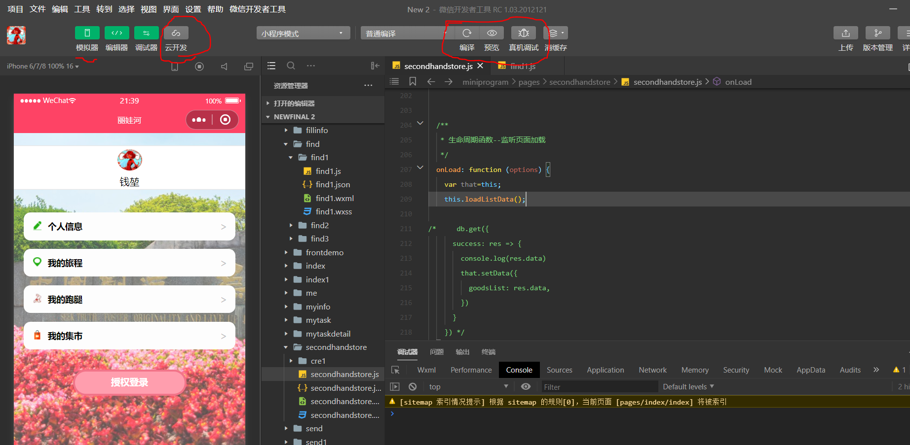

# README 

集成拼车回家、二手商城、跑腿为一体的小程序 

项目成员:cxn wwq qk

基于微信小程序开发助手

# 一.安装环境

微信小程序基于微信开发者工具，未安装点击以下链接安装：

[微信开发者工具 稳定版 Stable Build（1.03.2012120）](https://developers.weixin.qq.com/miniprogram/dev/devtools/download.html)

# 二.源码下载

最新源码已上传水杉码园:
http://gitea.shuishan.net.cn/10185501412/cloud_computing_final

下载最新版本（源码.zip）并解压

旧版本源码已上传github，有各个开发者版本控制的记录:
https://github.com/chixinn/cloud-computing

# 三.项目使用

## 1.打开项目

打开微信开发者工具，点击“+”号,得到以下界面

目录替换为源码解压后的文件夹中miniprogram的上一级文件夹

AppID填写 wxee86a9364b41f67e 

点击新建后即可进入测试环境

一个APPID有同一个云环境，即云数据库是各个开发者共享的

## 2.开发者环境使用

左边为模拟器预览模式，右边为代码（页面的代码在page文件夹中，通过控制台可以得知当前访问的页面名和代码位置），顶上有编译浏览和真机调试的选项，左上角的云开发按钮可以访问和管理云数据库和云存储（需要项目拥有者加权限）

## 3.获取开发者权限

该项目连接的云开发平台（包含云数据库，云存储等云服务）需要开发者权限才能访问，没有权限无法访问云开发平台项目会无法运行，如需权限请添加微信进行联系，微信号：Habseligkeit030

# 四.项目结构

│  .DS_Store
│  project.config.json
│  project.txt
│  README(2021.1.2).md
│  README.md
│  
├─cloudfunctions
│  │  .DS_Store
│  │  
│  └─login
│          config.json
│          index.js
│          package.json
│          
└─miniprogram
    │  .DS_Store
    │  app.js
    │  app.json
    │  app.wxss
    │  sitemap.json
    │  
    ├─components
    │  ├─chatroom
    │  │      chatroom.js
    │  │      chatroom.json
    │  │      chatroom.wxml
    │  │      chatroom.wxss
    │  │      dots.gif
    │  │      photo.png
    │  │      
    │  └─fixedBottom
    │          fixedBottom.js
    │          fixedBottom.json
    │          fixedBottom.wxml
    │          fixedBottom.wxss
    │          
    ├─images
    │      .DS_Store
    │      cre.jpg
    │      cre1.jpg
    │      get.png
    │      上海南火车站.jpg
    │      上海浦东机场.jpg
    │      上海火车站.jpg
    │      上海虹桥火车站.jpg
    │      信息.png
    │      创建1.png
    │      创建2.png
    │      市场1.png
    │      市场2.png
    │      我的1.png
    │      我的2.png
    │      旅程.png
    │      查找1.png
    │      查找2.png
    │      跑腿1.png
    │      跑腿2.png
    │      
    ├─pages
    │  │  .DS_Store
    │  │  
    │  ├─campustrip
    │  │      campustrop.js
    │  │      campustrop.json
    │  │      campustrop.wxml
    │  │      campustrop.wxss
    │  │      
    │  ├─create
    │  │  │  .DS_Store
    │  │  │  
    │  │  ├─cre1
    │  │  │      cre1.js
    │  │  │      cre1.json
    │  │  │      cre1.wxml
    │  │  │      cre1.wxss
    │  │  │      
    │  │  ├─cre2
    │  │  │      cre2.js
    │  │  │      cre2.json
    │  │  │      cre2.wxml
    │  │  │      cre2.wxss
    │  │  │      
    │  │  └─cre3
    │  │          cre3.js
    │  │          cre3.json
    │  │          cre3.wxml
    │  │          cre3.wxss
    │  │          
    │  ├─fillinfo
    │  │      fillinfo.js
    │  │      fillinfo.json
    │  │      fillinfo.wxml
    │  │      fillinfo.wxss
    │  │      
    │  ├─find
    │  │  │  .DS_Store
    │  │  │  
    │  │  ├─find1
    │  │  │      find1.js
    │  │  │      find1.json
    │  │  │      find1.wxml
    │  │  │      find1.wxss
    │  │  │      
    │  │  ├─find2
    │  │  │      find2.js
    │  │  │      find2.json
    │  │  │      find2.wxml
    │  │  │      find2.wxss
    │  │  │      
    │  │  └─find3
    │  │          find3.js
    │  │          find3.json
    │  │          find3.wxml
    │  │          find3.wxss
    │  │          
    │  ├─frontdemo
    │  │      frontdemo.js
    │  │      frontdemo.json
    │  │      frontdemo.wxml
    │  │      frontdemo.wxss
    │  │      
    │  ├─index
    │  │      index.js
    │  │      index.json
    │  │      index.wxml
    │  │      index.wxss
    │  │      
    │  ├─index1
    │  │      .DS_Store
    │  │      index1.js
    │  │      index1.json
    │  │      index1.wxml
    │  │      index1.wxss
    │  │      user-unlogin.png
    │  │      
    │  ├─me
    │  │      me.js
    │  │      me.json
    │  │      me.wxml
    │  │      me.wxss
    │  │      
    │  ├─myinfo
    │  │      myinfo.js
    │  │      myinfo.json
    │  │      myinfo.wxml
    │  │      myinfo.wxss
    │  │      
    │  ├─mytask
    │  │      mytask.js
    │  │      mytask.json
    │  │      mytask.wxml
    │  │      mytask.wxss
    │  │      
    │  ├─mytaskdetail
    │  │      mytaskdetail.js
    │  │      mytaskdetail.json
    │  │      mytaskdetail.wxml
    │  │      mytaskdetail.wxss
    │  │      
    │  ├─secondhandstore
    │  │  │  secondhandstore.js
    │  │  │  secondhandstore.json
    │  │  │  secondhandstore.wxml
    │  │  │  secondhandstore.wxss
    │  │  │  
    │  │  └─cre1
    │  │          cre1.js
    │  │          cre1.json
    │  │          cre1.wxml
    │  │          cre1.wxss
    │  │          
    │  ├─send
    │  │      send.js
    │  │      send.json
    │  │      send.wxml
    │  │      send.wxss
    │  │      
    │  ├─send1
    │  │      .DS_Store
    │  │      send1.js
    │  │      send1.json
    │  │      send1.wxml
    │  │      send1.wxss
    │  │      
    │  └─sendContent
    │          sendContent.js
    │          sendContent.json
    │          sendContent.wxml
    │          sendContent.wxss
    │          
    └─style
            guide.wxss

